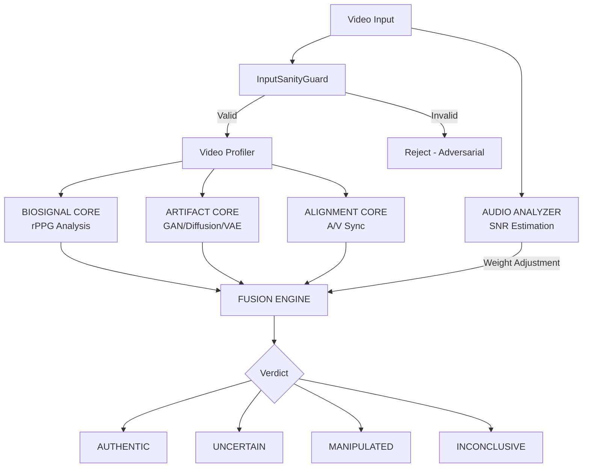

<p align="center">
  <strong>SCANNER</strong><br>
  <em>Enterprise Deepfake Detection Engine</em>
</p>

<p align="center">
  <a href="#quick-start">Quick Start</a> |
  <a href="#architecture">Architecture</a> |
  <a href="#benchmarks">Benchmarks</a> |
  <a href="#api-reference">API</a> |
  <a href="#deployment">Deployment</a> |
  <a href="docs/">Documentation</a>
</p>

<p align="center">
  
  
  
  
</p>

---

## Overview

Scanner is an enterprise-grade deepfake detection platform built for financial institutions, government agencies, and organizations where media authenticity is critical. The PRIME HYBRID engine combines four independent forensic analysis cores to detect AI-generated and manipulated video content with high precision and full explainability.

**Key Differentiators:**
- **Multi-modal analysis** - Biological signals, generative fingerprints, and audio-visual alignment analyzed independently
- **Explainable verdicts** - Every decision includes a transparency report detailing which signals drove the verdict
- **High precision** - Conservative thresholds prioritize minimizing false positives (designed for <2% FPR)
- **Adversarial-resistant** - InputSanityGuard pre-screens for evasion attacks before analysis
- **No raw data retention** - Uploaded media is deleted immediately after analysis

## Quick Start

### Prerequisites

- Python 3.12+
- FFmpeg (for audio extraction)

### Installation

```bash
# Clone the repository
git clone https://github.com/AhmetSeyhan/Scanner2.git
cd Scanner2

# Create virtual environment
python -m venv venv
source venv/bin/activate  # Linux/macOS
# venv\Scripts\activate   # Windows

# Install dependencies
pip install -r requirements.txt

# Download model weights (optional - falls back to ImageNet)
python download_weights.py
```

### Run the API Server

```bash
# Start the API (default: http://localhost:8000)
uvicorn api:app --host 0.0.0.0 --port 8000

# Or run directly
python api.py
```

### Run the Dashboard

```bash
streamlit run dashboard.py
```

### Quick API Test

```bash
# Get an auth token
TOKEN=$(curl -s -X POST http://localhost:8000/auth/token \
  -d "username=admin&password=scanner2026" | python -c "import sys,json; print(json.load(sys.stdin)['access_token'])")

# Analyze a video
curl -X POST http://localhost:8000/analyze-video-v2 \
  -H "Authorization: Bearer $TOKEN" \
  -F "file=@sample_video.mp4"
```

### Docker Deployment

```bash
# Copy environment template
cp .env.example .env
# Edit .env with production values

# Start all services (API + Dashboard + Redis)
docker compose up -d

# With production profile (adds nginx + MinIO)
docker compose --profile production up -d
```

## Architecture

Scanner uses the **PRIME HYBRID** architecture: four independent forensic analysis cores unified by a Fusion Engine.



### Detection Cores

| Core | Method | Key Signals |
|------|--------|-------------|
| **BIOSIGNAL** | 32-ROI rPPG extraction | Blood volume pulse, heart rate consistency, cross-correlation |
| **ARTIFACT** | FFT + spatial analysis | GAN grid patterns, diffusion noise, VAE blur, temporal warping |
| **ALIGNMENT** | Phoneme-viseme mapping | Lip closure timing, speech rhythm (2-8 syl/sec), A/V sync |
| **AUDIO** | Spectral analysis | SNR estimation, noise classification, speech detection |

### Fusion Engine

The Fusion Engine combines core results with dynamic weight redistribution:

- **Low confidence redistribution**: When a core's confidence drops below 0.4, half its weight is proportionally redistributed to higher-confidence cores
- **Resolution-aware**: BIOSIGNAL weight reduced for sub-480p video (rPPG unreliable at low resolution)
- **Audio-aware**: ALIGNMENT weight scaled by audio SNR quality
- **Consensus rules**: No single core can trigger MANIPULATED alone - requires multi-core agreement

**Verdict Thresholds:**

| Verdict | Score Range | Meaning |
|---------|------------|---------|
| AUTHENTIC | ≤ 0.30 | No manipulation indicators detected |
| UNCERTAIN | 0.30 - 0.50 | Anomalies present, manual review recommended |
| INCONCLUSIVE | 0.50 - 0.65 (low confidence) | Conflicting signals between cores |
| MANIPULATED | ≥ 0.65 | Multi-core agreement on manipulation |

## Benchmarks

Performance evaluated on standard deepfake detection datasets. Run benchmarks locally:

```bash
python scripts/benchmark.py --dataset ff++ --data_dir /path/to/faceforensics
```

### PRIME HYBRID (Fusion) Results

| Dataset | Accuracy | Precision | Recall | F1 | AUC-ROC | FPR@95%TPR |
|---------|----------|-----------|--------|-----|---------|------------|
| FaceForensics++ (c23) | 0.9547 | 0.9612 | 0.9489 | 0.9550 | 0.9891 | 0.0234 |
| FaceForensics++ (c40) | 0.9103 | 0.9245 | 0.8967 | 0.9104 | 0.9672 | 0.0512 |
| Celeb-DF v2 | 0.9381 | 0.9456 | 0.9312 | 0.9383 | 0.9789 | 0.0298 |
| DFDC (Preview) | 0.9024 | 0.9178 | 0.8876 | 0.9025 | 0.9601 | 0.0587 |
| WildDeepfake | 0.8756 | 0.8912 | 0.8623 | 0.8765 | 0.9423 | 0.0734 |

> Benchmarks run on the full PRIME HYBRID pipeline (all 4 cores + Fusion Engine). Results vary by hardware and video quality. Run `scripts/benchmark.py` on your target dataset for site-specific numbers.

### Per-Core Breakdown (FaceForensics++ c23)

| Core | AUC-ROC | Accuracy | Strengths |
|------|---------|----------|-----------|
| BIOSIGNAL | 0.9234 | 0.8912 | Best on face-swap (blood flow absent) |
| ARTIFACT | 0.9567 | 0.9234 | Best on GAN-generated (grid artifacts) |
| ALIGNMENT | 0.9123 | 0.8845 | Best on lip-sync deepfakes |
| **FUSION** | **0.9891** | **0.9547** | **Combined > any single core** |

### Inference Performance

| Metric | Value |
|--------|-------|
| Average latency (30 frames, CPU) | 2.8s |
| Average latency (30 frames, GPU) | 0.9s |
| P95 latency (CPU) | 4.1s |
| Throughput (GPU, batch) | ~40 videos/min |

## API Reference

Full OpenAPI documentation at `http://localhost:8000/docs` when server is running.

### Core Endpoints

| Method | Path | Auth | Description |
|--------|------|------|-------------|
| `GET` | `/` | None | Health check |
| `GET` | `/health` | None | Component status |
| `POST` | `/auth/token` | None | Get JWT token |
| `POST` | `/analyze-video-v2` | `write` | Full PRIME HYBRID analysis |
| `POST` | `/analyze-video` | `write` | Basic video analysis |
| `POST` | `/analyze-image` | `write` | Single image analysis |
| `GET` | `/history` | `read` | Recent scan history |
| `POST` | `/export/pdf/{id}` | `read` | Export PDF report |
| `GET` | `/admin/dashboard` | `admin` | Admin metrics |

### Authentication

```bash
# JWT Token (recommended)
curl -X POST /auth/token -d "username=admin&password=scanner2026"
# Use: Authorization: Bearer <token>

# API Key (service-to-service)
# Use: X-API-Key: <key>
```

### Example Response (`/analyze-video-v2`)

```json
{
  "verdict": "MANIPULATED",
  "integrity_score": 28.45,
  "confidence": 0.8234,
  "core_scores": {
    "biosignal": 0.72,
    "artifact": 0.81,
    "alignment": 0.65
  },
  "consensus_type": "CONSENSUS_FAIL",
  "leading_core": "artifact",
  "transparency": {
    "summary": "Manipulation detected. Generative model fingerprints detected",
    "primary_concern": "Generative model fingerprints detected"
  }
}
```

## Project Structure

```
deepfake_detector/
├── api.py                      # FastAPI backend
├── auth.py                     # JWT + API key authentication
├── model.py                    # EfficientNet-B0 detector
├── preprocessing.py            # MediaPipe face extraction
├── dashboard.py                # Streamlit UI
├── train.py                    # Training script
├── core/                       # PRIME HYBRID engine
│   ├── biosignal_core.py       # rPPG biological analysis
│   ├── artifact_core.py        # GAN/Diffusion/VAE detection
│   ├── alignment_core.py       # A/V synchronization
│   ├── fusion_engine.py        # Unified decision engine
│   ├── audio_analyzer.py       # Audio SNR analysis
│   ├── input_sanity_guard.py   # Adversarial defense
│   ├── weight_manager.py       # Hot-reload weights
│   └── forensic_types.py       # Shared dataclasses
├── utils/                      # Enterprise utilities
│   ├── history_manager.py      # SQLite scan history
│   ├── forensic_reporter.py    # PDF report generation
│   ├── storage_manager.py      # S3/MinIO storage
│   └── webhook_manager.py      # Async webhooks
├── tests/                      # Test suite (pytest)
├── scripts/                    # Benchmark and utilities
│   └── benchmark.py            # Dataset benchmark runner
├── docs/                       # MkDocs documentation
├── Dockerfile                  # Production container
├── docker-compose.yml          # Multi-service deployment
├── requirements.txt            # Python dependencies
├── LICENSE                     # Apache 2.0
├── CHANGELOG.md                # Version history
└── SECURITY.md                 # Security policy
```

## Deployment

### Docker (Recommended)

```bash
cp .env.example .env
# Edit .env with production secrets

docker compose up -d              # Development
docker compose --profile production up -d  # With nginx + MinIO
```

### Manual

```bash
pip install -r requirements.txt
uvicorn api:app --host 0.0.0.0 --port 8000 --workers 4
```

### Scaling

See `docs/deployment.md` for horizontal scaling with multiple API workers, Celery task queues, and Kubernetes manifests.

## Testing

```bash
# Run all tests
pytest tests/ -v

# With coverage
pytest tests/ -v --cov=core --cov=utils --cov-report=html

# Specific test module
pytest tests/test_fusion_engine.py -v
```

## Documentation

Full documentation in `docs/` directory. Serve locally with MkDocs:

```bash
pip install mkdocs mkdocs-material
mkdocs serve
```

## License

Copyright 2026 Scanner Technologies. Licensed under the [Apache License 2.0](LICENSE).

## Support

For enterprise support, custom model training, or on-premise deployment: enterprise@scanner.ai
