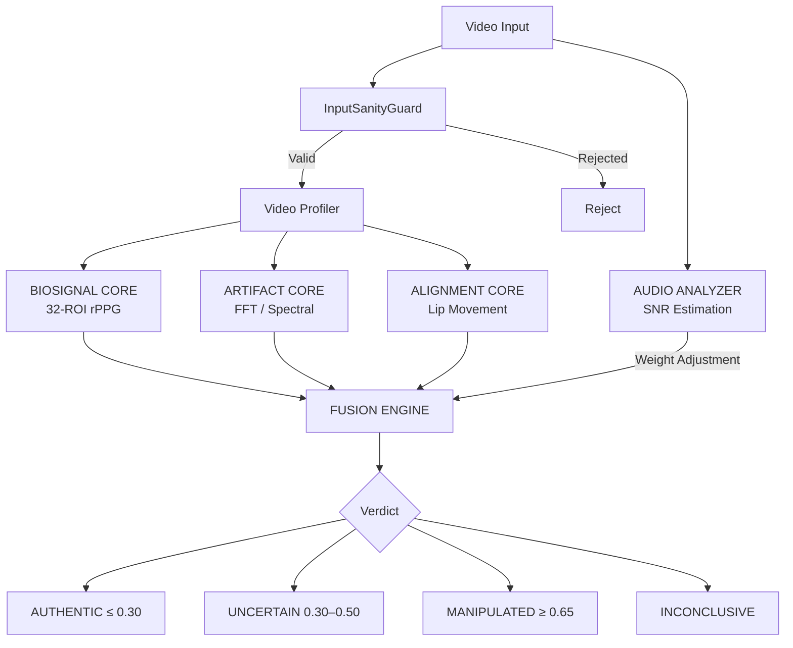

<p align="center">
  <strong>SCANNER</strong><br>
  <em>Multi-Modal Deepfake Detection Engine</em>
</p>

<p align="center">
  <a href="#quick-start">Quick Start</a> |
  <a href="#architecture">Architecture</a> |
  <a href="#api-reference">API</a> |
  <a href="#deployment">Deployment</a> |
  <a href="docs/">Documentation</a>
</p>

<p align="center">
  
  
  
  
</p>

---

## Overview

Scanner is a multi-modal deepfake detection platform designed for financial institutions, KYC/identity verification, and organizations where media authenticity is critical.

The **PRIME HYBRID** engine analyzes video through four independent forensic signal domains — biological signals (rPPG), generative model fingerprints (FFT/spectral), audio-visual alignment, and audio quality — then combines results through a weighted fusion engine with full verdict explainability.

### What Scanner Does

- **Frame-Level Visual Detection** — EfficientNet-B0 backbone trained on FaceForensics++ classifies individual frames as real or manipulated.
- **Biological Signal Analysis (BioSignalCore)** — Extracts remote photoplethysmography (rPPG) signals from 32 facial ROIs and checks cross-correlation for biological consistency.
- **Generative Fingerprint Detection (ArtifactCore)** — Analyzes frequency domain (FFT) for GAN grid artifacts, diffusion noise patterns, and VAE blur signatures. Includes temporal warping detection via optical flow.
- **Audio-Visual Alignment (AlignmentCore)** — Checks lip movement patterns for speech rhythm consistency and phoneme-viseme timing plausibility.
- **Fusion Engine** — Combines all core results with dynamic weight redistribution based on input quality (resolution, audio SNR). Produces a single explainable verdict.

### Design Principles

- **High precision over high recall** — Conservative thresholds minimize false positives. Better to say "uncertain" than to falsely accuse.
- **No single core decides alone** — The MANIPULATED verdict requires multi-core agreement.
- **Full explainability** — Every verdict includes a transparency report: which signals drove the decision, what weights were used, and why.
- **No raw data retention** — Uploaded media is deleted immediately after analysis. Only the verdict and metadata are stored.

### Current Maturity

| Capability | Status | Notes |
|-----------|--------|-------|
| Frame-level visual classification | **Production** | EfficientNet-B0 with optional FaceForensics++ weights |
| Generative fingerprint analysis | **Beta** | FFT/spectral heuristics, validated on synthetic data |
| Biological signal analysis (rPPG) | **Beta** | Works best on 480p+ video at 24+ fps |
| Audio-visual alignment | **Beta** | Lip movement pattern analysis; no phoneme-level ASR |
| Multi-modal fusion | **Beta** | Weighted fusion with dynamic redistribution |
| Adversarial input guard | **Beta** | Frame consistency and gradient analysis |
| API + Auth + Rate limiting | **Production** | JWT + API key, slowapi |
| PDF forensic reports | **Production** | SHA-256 hashed, ReportLab |
| Docker deployment | **Production** | Multi-service compose with Redis |

> **Note on "Beta" cores:** The signal processing algorithms (rPPG, FFT artifacts, lip-sync) implement peer-reviewed techniques but have not yet been validated against large-scale benchmark datasets with controlled methodology. Accuracy numbers will be published after formal evaluation. See [Validation Roadmap](#validation-roadmap) below.

## Quick Start

### Prerequisites

- Python 3.12+
- FFmpeg (for audio extraction)

### Installation

```bash
git clone https://github.com/AhmetSeyhan/Scanner2.git
cd Scanner2

python -m venv venv
source venv/bin/activate  # Linux/macOS

pip install -r requirements.txt

# Optional: download pre-trained deepfake weights
python download_weights.py
```

### Configuration

```bash
cp .env.example .env
# Edit .env — set at minimum:
#   SCANNER_SECRET_KEY (JWT signing)
#   SCANNER_API_KEY (service auth)
#   SCANNER_ADMIN_PASSWORD (admin account)
```

### Run

```bash
# API server
uvicorn api:app --host 0.0.0.0 --port 8000

# Dashboard (separate terminal)
streamlit run dashboard.py
```

### Docker

```bash
cp .env.example .env
# Edit .env with production values

docker compose up -d                              # Development
docker compose --profile production up -d          # With nginx + MinIO
```

## Architecture



### Detection Cores

| Core | Method | Signals Analyzed |
|------|--------|-----------------|
| **BIOSIGNAL** | 32-ROI rPPG, Butterworth bandpass, cross-correlation | Blood volume pulse, HR consistency across regions |
| **ARTIFACT** | 2D FFT, Laplacian blur, kurtosis, optical flow | GAN grid patterns, diffusion noise, VAE blur, temporal warping |
| **ALIGNMENT** | Mouth region pixel analysis, FFT rhythm detection | Lip closure timing, speech rhythm (2–8 syl/sec), brightness consistency |
| **AUDIO** | Spectral SNR estimation, ZCR-based VAD | Signal-to-noise ratio, speech presence, noise classification |

### Fusion Engine

- **Weighted average** of core scores (default) or confidence-product mode
- **Dynamic redistribution**: if a core's confidence < 0.4, half its weight goes to higher-confidence cores
- **Resolution-aware**: BIOSIGNAL weight reduced for sub-480p (rPPG unreliable)
- **Audio-aware**: ALIGNMENT weight scaled by audio SNR
- **Consensus rule**: No single core can trigger MANIPULATED — requires 2+ cores agreeing

### Verdict Thresholds

| Verdict | Score Range | Meaning |
|---------|------------|---------|
| AUTHENTIC | ≤ 0.30 | No manipulation indicators |
| UNCERTAIN | 0.30–0.50 | Anomalies present, manual review recommended |
| INCONCLUSIVE | 0.50–0.65 (low confidence) | Conflicting signals |
| MANIPULATED | ≥ 0.65 | Multi-core agreement on manipulation |

## API Reference

Full OpenAPI documentation at `http://localhost:8000/docs`.

| Method | Path | Auth | Description |
|--------|------|------|-------------|
| `GET` | `/` | — | Health check |
| `GET` | `/health` | — | Component status |
| `POST` | `/auth/token` | — | Get JWT token |
| `POST` | `/analyze-video-v2` | `write` | Full PRIME HYBRID analysis |
| `POST` | `/analyze-video` | `write` | Basic visual-only analysis |
| `POST` | `/analyze-image` | `write` | Single image analysis |
| `GET` | `/history` | `read` | Recent scan history |
| `POST` | `/export/pdf/{id}` | `read` | Export PDF report |
| `GET` | `/admin/dashboard` | `admin` | Admin metrics |

### Authentication

```bash
# JWT Token
curl -X POST http://localhost:8000/auth/token \
  -d "username=admin&password=$SCANNER_ADMIN_PASSWORD"

# API Key
curl -H "X-API-Key: $SCANNER_API_KEY" http://localhost:8000/health
```

### Example Response (`/analyze-video-v2`)

```json
{
  "verdict": "MANIPULATED",
  "integrity_score": 28.45,
  "confidence": 0.82,
  "core_scores": {
    "biosignal": 0.72,
    "artifact": 0.81,
    "alignment": 0.65
  },
  "consensus_type": "CONSENSUS_FAIL",
  "leading_core": "artifact",
  "transparency": {
    "summary": "Manipulation detected. Generative model fingerprints detected.",
    "primary_concern": "Generative model fingerprints detected",
    "environmental_factors": ["Low resolution (360p): BIOSIGNAL weight reduced"]
  }
}
```

## Project Structure

```
deepfake_detector/
├── api.py                      # FastAPI backend (14 endpoints)
├── auth.py                     # JWT + API key auth (env-based credentials)
├── model.py                    # EfficientNet-B0 detector
├── preprocessing.py            # MediaPipe face extraction
├── dashboard.py                # Streamlit UI
├── core/                       # PRIME HYBRID engine
│   ├── biosignal_core.py       # rPPG biological analysis
│   ├── artifact_core.py        # GAN/Diffusion/VAE detection + heatmap
│   ├── alignment_core.py       # Lip movement / A-V alignment
│   ├── fusion_engine.py        # Weighted fusion + consensus
│   ├── audio_analyzer.py       # Audio SNR / speech detection
│   ├── input_sanity_guard.py   # Adversarial input validation
│   ├── weight_manager.py       # Hot-reload for weights
│   └── forensic_types.py       # Shared dataclasses
├── utils/                      # Enterprise features
│   ├── history_manager.py      # SQLite scan history
│   ├── forensic_reporter.py    # PDF report generation
│   ├── storage_manager.py      # S3/MinIO storage
│   └── webhook_manager.py      # Async webhook notifications
├── tests/                      # pytest suite (81 passing)
├── scripts/benchmark.py        # Dataset evaluation tool
├── Dockerfile                  # Production container
├── docker-compose.yml          # Multi-service deployment
└── requirements.txt            # Dependencies
```

## Testing

```bash
pytest tests/ -v                                   # Run all tests
pytest tests/ -v --cov=core --cov=utils            # With coverage
pytest tests/test_fusion_engine.py -v              # Specific module
```

Current status: **81 passed, 25 skipped** (skips are due to optional dependencies like reportlab, mediapipe).

## Security

- **Authentication**: JWT (HS256) + API key with scoped access (read/write/admin)
- **Rate limiting**: slowapi + Redis (configurable, default 10 req/min/IP)
- **No raw data retention**: uploaded files deleted after analysis
- **Credential management**: all secrets via environment variables; production mode enforces mandatory configuration
- **Docker**: non-root user, health checks, resource limits

See [SECURITY.md](SECURITY.md) for the full security policy, threat model, and GDPR/KVKK compliance notes.

## Validation Roadmap

The following evaluation work is planned before production deployment:

- [ ] Run `scripts/benchmark.py` against FaceForensics++ (c23, c40) with controlled methodology
- [ ] Evaluate on Celeb-DF v2 and DFDC Preview for cross-dataset generalization
- [ ] Measure per-core contribution (ablation: fusion vs. individual cores)
- [ ] Establish FPR@95%TPR thresholds for bank KYC use case
- [ ] Third-party audit of detection accuracy on client-provided video samples
- [ ] Adversarial robustness testing (FGSM, PGD, patch attacks)

Benchmark results will be published here after formal evaluation. The `scripts/benchmark.py` tool is ready for dataset evaluation — see `docs/benchmarks.md` for usage.

## License

Copyright 2026 Scanner Technologies. Licensed under the [Apache License 2.0](LICENSE).

## Support

For enterprise integration, custom model training, or on-premise deployment inquiries: enterprise@scanner.ai
