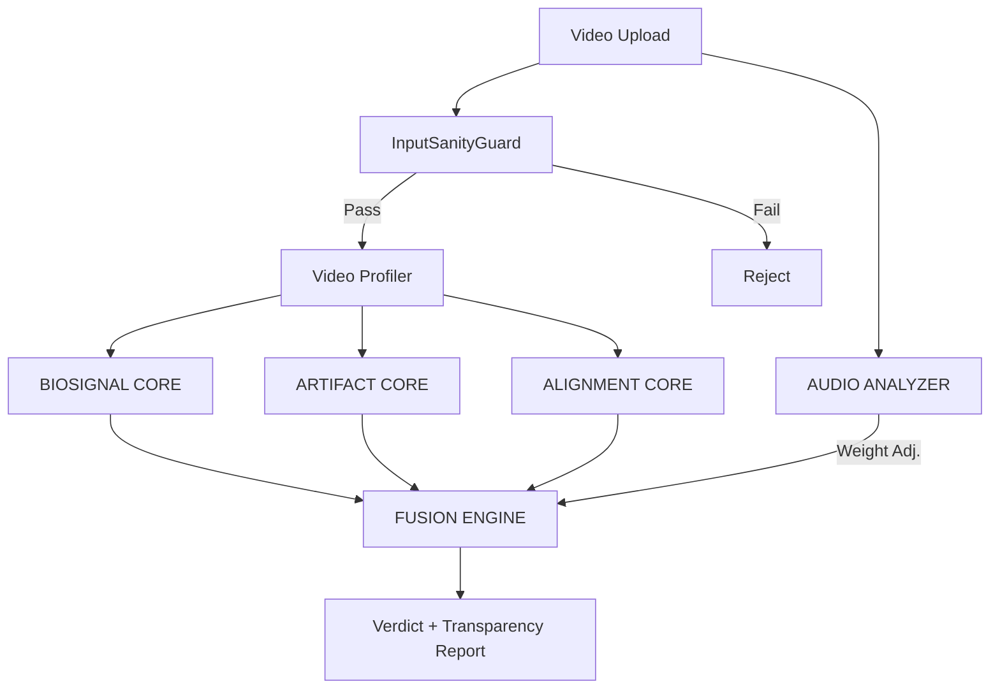

# Architecture

## PRIME HYBRID Engine

Scanner's detection engine uses four independent forensic analysis cores unified by a Fusion Engine. Each core specializes in a different detection domain and operates independently, enabling dynamic weight redistribution based on input quality.

## Core Modules

### BIOSIGNAL CORE (`biosignal_core.py`)

Analyzes biological plausibility via remote photoplethysmography (rPPG).

- **32-Region ROI Grid**: 8x4 grid over face regions with weighted importance
    - Cheeks: 1.2x weight (strongest blood flow signal)
    - Forehead: 1.0x weight
    - Other regions: 0.8x weight
- **Green-Channel Pulse Extraction**: Blood volume pulse from green channel intensity
- **Butterworth Bandpass Filter**: 0.7-4.0 Hz (42-240 BPM) with multi-order fallback
- **Cross-Correlation Analysis**: Detects biological synchronization between ROI regions

### ARTIFACT CORE (`artifact_core.py`)

Detects generative model fingerprints left by synthesis algorithms.

- **GAN Fingerprints**: FFT grid artifact analysis for upsampling patterns
- **Diffusion Fingerprints**: Uniform noise pattern detection
- **VAE Fingerprints**: Blur signatures from reconstruction loss
- **Temporal Warping**: Optical flow analysis for unnatural movement
- **Spatial Heatmap**: 8x8 grid anomaly visualization for forensic review

### ALIGNMENT CORE (`alignment_core.py`)

Validates audio-visual synchronization through phoneme-viseme mapping.

- **Bilabial Analysis**: P, B, M phonemes require lip closure - checks timing
- **Speech Rhythm**: FFT-based syllable rate detection (2-8 syllables/second)
- **A/V Sync Scoring**: Millisecond-level lip-audio alignment
- **Metadata Forensics**: Compression artifact analysis

### AUDIO ANALYZER (`audio_analyzer.py`)

Assesses audio quality to dynamically adjust ALIGNMENT CORE weight.

| SNR Range | Noise Level | ALIGNMENT Weight |
|-----------|-------------|-----------------|
| >= 20 dB | LOW | 1.0 (full) |
| 10-20 dB | MEDIUM | 0.7 |
| 5-10 dB | HIGH | 0.5 |
| < 5 dB | EXTREME | 0.3 |

## Fusion Engine

### Weight Redistribution

The Fusion Engine dynamically adjusts core weights based on:

1. **Confidence**: Cores with confidence < 0.4 lose 50% of their weight, redistributed proportionally
2. **Resolution**: Low-res video (< 480p) reduces BIOSIGNAL weight from 33% to 20%
3. **Audio Quality**: No audio or high noise reduces ALIGNMENT weight

### Consensus Rules

- **CONSENSUS_FAIL**: 2+ cores indicate manipulation → strongest signal
- **CONSENSUS_PASS**: 2+ cores indicate authentic → high confidence authentic
- **DEFER_TO_X**: One core has very high confidence (> 0.8) with FAIL
- **INCONCLUSIVE**: Conflicting signals, no clear answer

### Verdict Determination

No single core can trigger MANIPULATED alone. The system requires multi-core agreement, reducing false positives.

## InputSanityGuard

Pre-analysis defense layer that screens for:

- Adversarial perturbations (gradient analysis + FFT frequency checks)
- Frame sequence anomalies (duplicate detection, splice detection)
- Resolution inconsistencies
- Content integrity (NaN, Inf, extreme pixel values)
